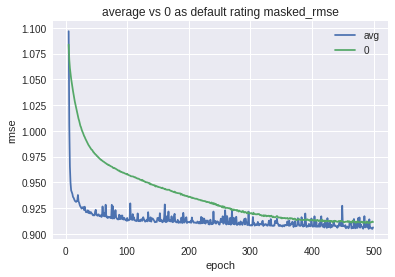
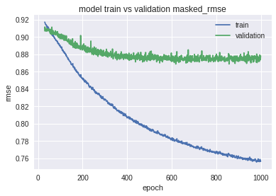
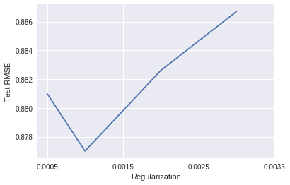
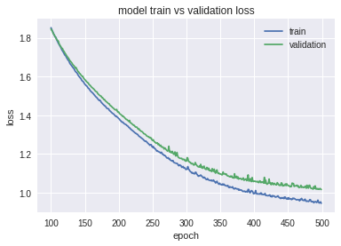
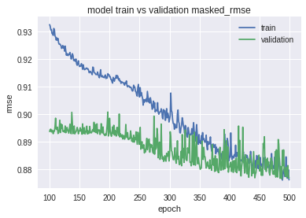
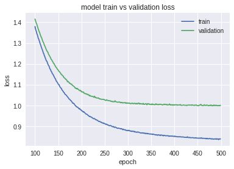
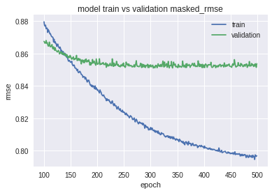
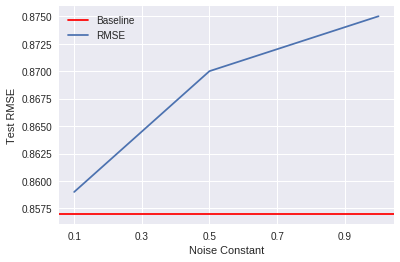

# Deep Autoencoder Recommendation 

## Table of Contents

1. Introduction 
2. Data Preprocessing
3. AutoRec and Experiments
4. Deep AutoRec and Experiments
5. Denoising Experiments
6. Hybrid Experiments
7. Other Experiments
8. Conclusion & Future Work
9. Reference

The Jupyter Note book of this project can be found [here](https://github.com/RaptorMai/Deep-AutoEncoder-Recommendation)

## 1. Introduction

Autoencoder has been widely adopted into Collaborative Filtering (CF) for recommendation system. A classic CF problem is inferring the missing rating in an MxN matrix R where R(i, j) is the ratings given by the i<sup>th</sup> user to the j<sup>th</sup> item. This project is a Keras implementation of  AutoRec [1] and Deep AutoRec [2] and additional experiments will be run. 

The data I used is MovieLens 1M Dataset.

## 2. Data Preprocessing

####Raw data preprocessing

The raw data file is separated by ```::``` without headers. This part is transforming the raw data file into a CSV with headers, which can be easily imported using Pandas in the following parts. All the user and movie id will be subtracted by 1 for zero-based index. The snippet shows the preprocessing for rating data and similar preprocessing is applied to users data and movies data.

```python
ratings = pd.read_csv(os.path.join(MOVIELENS_DIR, RATING_DATA_FILE), 
                    sep='::', 
                    engine='python', 
                    encoding='latin-1',
                    names=['userid', 'movieid', 'rating', 'timestamp'])

ratings['user_emb_id'] = ratings['userid'] - 1
ratings['movie_emb_id'] = ratings['movieid'] - 1
print(len(ratings), 'ratings loaded')
ratings.to_csv(RATINGS_CSV_FILE, 
               sep='\t', 
               header=True, 
               encoding='latin-1', 
               columns=['user_emb_id', 'movie_emb_id', 'rating', 'timestamp'])
print('Saved to', RATINGS_CSV_FILE)
```


#### Train, Validation and Test Split

```python
df = pd.read_csv('ml1m_ratings.csv',sep='\t', encoding='latin-1', 
                      usecols=['user_emb_id', 'movie_emb_id', 'rating', 'timestamp'])
num_users = df['user_emb_id'].unique().max() + 1
num_movies = df['movie_emb_id'].unique().max() + 1

train_df, test_df = train_test_split(df,
                                     stratify=df['user_emb_id'],
                                     test_size=0.1,
                                     random_state=999613182)   
train_df, validate_df = train_test_split(train_df,
                                 stratify=train_df['user_emb_id'],
                                 test_size=0.1,
                                 random_state=999613182)  
```

I split the data into random 90%–10% train-test sets, and hold out 10% of the training set for validation.

I used a fixed random_state = 999613182 for reproduction.  When I use ```train_test_split``` from ```sklearn``` , I use **Stratify with user_id** . This setting is critical, without this setting,  it's possible that reviews of one user are all split into one the training or test set and cause bias. For example if all the reviews of user A are put into the training set, then during test time, there is no test data for this user. The test RMSE will be 0 for this user. On the other hand, if all reviews are put into test set, then there is no review for this user during training time and cause the RMSE higher for this user.  


#### Transform DataFrame to matrix


​							Figure 1: Dataframe containing ratings data

```python
def dataPreprocessor(rating_df, num_users, num_items, init_value=0, average=False):
    """
        INPUT: 
            data: pandas DataFrame. columns=['index', 'userID', 'itemID', 'rating' ...]
            num_row: int. number of users
            num_col: int. number of items
            
        OUTPUT:
            matrix: 2D numpy array. 
    """
    if average:
      matrix = np.full((num_users, num_items), 0.0)
      for (_, userID, itemID, rating, timestamp) in rating_df.itertuples():
        matrix[userID, itemID] = rating
      avergae = np.true_divide(matrix.sum(1), np.maximum((matrix!=0).sum(1), 1))
      inds = np.where(matrix == 0)
      matrix[inds] = np.take(avergae, inds[0])
      
    else:
      matrix = np.full((num_users, num_items), init_value)
      for (_, userID, itemID, rating, timestamp) in rating_df.itertuples():
        matrix[userID, itemID] = rating

    return matrix
```

In order to apply AutoRec on the dataset, the dataset should be transformed to a MxN matrix where R(i, j) is the ratings given by the i<sup>th</sup> user to the j<sup>th</sup> item. 

The function ```dataPreprocessor``` is used for this transformation. The init_value is the default rating for unobserved ratings. If ```average ``` is set to ```True```, the unobvserved rating will be set as the average rating of the user.


## 3. AutoRec and Experiment

### AutoRec


​			Figure2: Item-based AutoRec Model shown in the the AutoRec Paper[1]


The model I am going to implement is a user-based AutoRec, which take the partially observed ratings vector of a user, project it into a low dimensional latent space and then reconstruct back to the output space to predict the missing rating. 


#### Loss Function

Since it does not make sense to predict zero in the user rating vector, I follow the AutoRec paper to minimize the Masked Mean Squared Error(MMSE). 


where r<sub>i</sub> is the actual rating and y<sub>i</sub> is the reconstructed rating. m<sub>i</sub> is a mask function where m<sub>i</sub> =1 where  r<sub>i</sub> is non-zero else m<sub>i</sub>=0. 

Since Masked Mean Squared Error is not provided in Keras, so I need to customize the error function.

```python
def masked_mse(y_true, y_pred):
  			# masked function
        mask_true = K.cast(K.not_equal(y_true, 0), K.floatx())
      	# masked squared error
        masked_squared_error = K.square(mask_true * (y_true - y_pred))
				# average the error
        masked_mse = K.sum(masked_squared_error, axis=-1) / K.maximum(K.sum(mask_true, 
                                                                            axis=-1), 1)
        return masked_mse
```


#### Metric

The performance of the model is measured by the Masked Root Mean Squared Error (MRMSE). Similar to MMSE, we only take into consideration the error where the rating is not zero in the test set. Also, I clip the predicted rating with 1 as minimum and 5 as maximum. 

```python
def masked_rmse_clip(y_true, y_pred):
  			# masked function
        mask_true = K.cast(K.not_equal(y_true, 0), K.floatx())
      	# clipping the rating
        y_pred = K.clip(y_pred, 1, 5)
        # masked squared error
        masked_squared_error = K.square(mask_true * (y_true - y_pred))
        # square root
        masked_mse = K.sqrt(K.sum(masked_squared_error, axis=-1) / 
                            K.maximum(K.sum(mask_true, axis=-1), 1))
        return masked_mse
```


#### Model

```python
def AutoRec(X, reg, first_activation, last_activation):
    '''
    AutoRec
    '''
    input_layer = x = Input(shape=(X.shape[1],), name='UserRating')
    
    x = Dense(500, activation=first_activation, name='LatentSpace', 
              kernel_regularizer=regularizers.l2(reg))(x)
    
    output_layer = Dense(X.shape[1], activation=last_activation, name='UserScorePred', 
                         kernel_regularizer=regularizers.l2(reg))(x)
    
    model = Model(input_layer, output_layer)

    return model
  
_________________________________________________________________
Layer (type)                 Output Shape              Param #   
=================================================================
UserRating (InputLayer)      (None, 3952)              0         
_________________________________________________________________
LatentSpace (Dense)          (None, 500)               1976500   
_________________________________________________________________
UserScorePred (Dense)        (None, 3952)              1979952   
=================================================================
Total params: 3,956,452
Trainable params: 3,956,452
Non-trainable params: 0
_________________________________________________________________
```


​			

#### Baseline Settings

```python
# Build model
AutoRec = AutoRec(users_items_matrix_train_zero)
AutoRec.compile(optimizer = Adam(lr=0.0001), loss=masked_mse, metrics=[masked_rmse_clip])
hist_Autorec = AutoRec.fit(x=users_items_matrix_train_zero, y=users_items_matrix_train_zero,
                  epochs=500,
                  batch_size=256,
                  verbose = 2, 
                  validation_data=[users_items_matrix_train_zero,
                                   users_items_matrix_validate])
```


| L2 Regularization | Optimizer | Learning Rate | Epochs | Batch Size | Activations      | Default Rating |
| :---------------: | :-------: | :-----------: | ------ | :--------: | ---------------- | :------------: |
|       0.001       |   Adam    |    0.0001     | 500    |    256     | Sigmoid + Linear |       0        |

​							Table1: Baseline settings of AutoRec

###Experiments

#### Activations

In the AutoRec paper, it only tested sigmoid and linear. Since the Deep_AE_CF paper [2] found that
activations with **non-zero negative part** and **unbounded positive part** perform better for deep autoencoders for CF. So I tried ELU, SELU and LRELU on AutoRec.

|  Activation   |                    **Modification**                     | **Test RMSE** | **Train RMSE** |
| :-----------: | :-----------------------------------------------------: | :-----------: | :------------: |
|   Baseline    |                Keep L2 $$\lambda$$ 0.001                |  ***0.916***  |  ***0.914***   |
|   ELU, ELU    | change L2 $$\lambda$$ from 0.001 to 0.01 due to overfit |     0.931     |     0.944      |
|  ELU, Linear  | change L2 $$\lambda$$ from 0.001 to 0.01 due to overfit |    0.9338     |     0.943      |
|  SELU, SELU   | change L2 $$\lambda$$ from 0.001 to 0.01 due to overfit |    0.9431     |     0.9543     |
| SELU, Linear  | change L2 $$\lambda$$ from 0.001 to 0.01 due to overfit |     0.957     |     0.964      |
| LRelu, LRelu  | change L2 $$\lambda$$ from 0.001 to 0.01 due to overfit |    0.9336     |     0.945      |
| LRelu, Linear | change L2 $$\lambda$$ from 0.001 to 0.01 due to overfit |    0.9386     |     0.9486     |
| Sigmoid, ELU  |                Keep L2 $$\lambda$$ 0.001                | ***0.9137***  |  ***0.9156***  |
|   Tanh, ELU   |                Keep L2 $$\lambda$$ 0.001                |    0.9454     |     0.963      |

​						Table2: Comparing Activation Functions on AutoRec

All the hyper-parameters including L2 $$\lambda$$ , learning rate and epochs are not fine-tuned, so the result is  not as good as the AutoRec paper. But we can find out activations that perform well in Deep Autoencoder CF do not outperform the Sigmoid+Linear baseline. Also, we found that when changing the activation from Sigmod to other activations with unbounded positive part, the model is easier to overfit. 


#### Default Rating

In the Deep_AE_CF paper, the default rating is 0 while in the AutoRec paper, the default rating is 3. So, I decided to tried different default ratings.

| Default Rating | Modification | Test RMSE | Train RMSE |
| :------------: | :----------: | :-------: | :--------: |
|  0 (Baseline)  |     N/A      | **0.916** |   0.914    |
|       1        |     N/A      |   0.926   |   0.932    |
|       2        |     N/A      |   0.933   |   0.944    |
|       3        |     N/A      |   0.945   |    0.96    |
|       4        |     N/A      |  0.9445   |   0.960    |
|       5        |     N/A      |   0.943   |   0.958    |
|    Average     |     N/A      | **0.912** |   0.923    |

​						Table3: Comparing default ratings for unobserved rating




​						                Figure3: Average Vs 0 as default rating

As we can see, average and 0 outperform other default ratings. When we comparing the Val_RMSE of 0 and average, we found that **using the average as default rating converge much faster than using 0 but with more noise.** 


#### Unexpected finding

Before I moved to the next experiment, I tried ELU + ELU as activations with the avergae as default rating, it turns out to work pretty well with the default L2 $$\lambda$$ 0.001. For Autorect, it seems this is the best model we have so far. The gap between validation loss and training loss is pretty small and increasing the regularization did not help, so I think we should move deeper to increase the model complexity.

| Default Rating | Modification | Test RMSE | Train RMSE |
| :------------: | :----------: | :-------: | :--------: |
|  0 (Baseline)  |              |   0.916   |   0.914    |
|    Average     |   ELU+ELU    | **0.877** |   0.806    |
|    Average     |  SELU+SELU   | **0.878** |   0.748    |

​			Table4: Use Avergae as default rating works good using ELU+ELU on AutoRec


<p>
  
   
</p>


​					Figure4: Training Vs Validation Masked RMSE and Loss (Average, ELU+ELU)



​						Figure5: Test RMSE as the regularization parameters varies


## 4. Deep AutoRec and Experiments

### Deep Autoencoder Collaborative Filtering


This paper continued the AutoRec idea to deepen Autoencoder. It uses MMSE as loss function, same as AutoRec. It proposes activation functions with non-zero negative part and unbounded positive part works better. Also, it uses dropout layers after the latent layer to avoid overfitting. It also shows that using large dropout rate after the latent layer allows it to learn robust representations. 


```python
  def Deep_AE_model(X, layers, activation, last_activation, dropout, regularizer_encode, regularizer_decode):
    '''
        Build Deep AE for CF
        INPUT: 
            X: #_user X #_item matrix
            layers: List, each element is the number of neuron for a layer
            reg: L2 regularization parameter
            activation: activation function for all dense layer except the last
            last_activation: activation function for the last dense layer
            dropout: dropout rate
            regularizer_encode: regularizer for encoder
            regularizer_decode: regularizer for decoder
        OUTPUT:
            Keras model
    '''

    # Input
    input_layer = x = Input(shape=(X.shape[1],), name='UserRating')
    
    # Encoder
    # -----------------------------
    k = int(len(layers)/2)
    i = 0
    for l in layers[:k]:
      x = Dense(l, activation=activation,     
                name='EncLayer{}'.format(i), 
                kernel_regularizer=regularizers.l2(regularizer_encode))(x)
      i = i+1
      
      
    # Latent Space
    # -----------------------------
    x = Dense(layers[k], activation=activation, 
              name='LatentSpace', kernel_regularizer=regularizers.l2(regularizer_encode))(x)
    
    # Dropout
    x = Dropout(rate = dropout)(x)
    
    # Decoder
    # -----------------------------
    for l in layers[k+1:]:
      i = i-1
      x = Dense(l, activation=activation, 
                name='DecLayer{}'.format(i),
                kernel_regularizer=regularizers.l2(regularizer_decode))(x)
    
    # Output
    output_layer = Dense(X.shape[1], activation=last_activation, name='UserScorePred', 
                         kernel_regularizer=regularizers.l2(regularizer_decode))(x)

    # this model maps an input to its reconstruction
    model = Model(input_layer, output_layer)

    return model
  
Example Summary
_________________________________________________________________
Layer (type)                 Output Shape              Param #   
=================================================================
UserRating (InputLayer)      (None, 3952)              0         
_________________________________________________________________
EncLayer0 (Dense)            (None, 128)               505984    
_________________________________________________________________
EncLayer1 (Dense)            (None, 256)               33024     
_________________________________________________________________
LatentSpace (Dense)          (None, 512)               131584    
_________________________________________________________________
dropout_1 (Dropout)          (None, 512)               0         
_________________________________________________________________
DecLayer1 (Dense)            (None, 256)               131328    
_________________________________________________________________
DecLayer0 (Dense)            (None, 128)               32896     
_________________________________________________________________
UserScorePred (Dense)        (None, 3952)              509808    
=================================================================
Total params: 1,344,624
Trainable params: 1,344,624
Non-trainable params: 0
```

Baseline setting

| L2 Regularization | Optimizer | Learning Rate | Epochs | Batch Size | Activations | Default Rating | Dropout |
| :---------------: | :-------: | :-----------: | ------ | :--------: | ----------- | :------------: | :-----: |
|       0.001       |   Adam    |    0.0001     | 500    |    256     | SELU+SELU   |       0        |   0.8   |


####Architecture

In the paper, it proposes different architectures for different Netflix datasets. But I found that all architectures have the largest layer in the middle and smaller layers at the begining and the end. I called this structure Small-Big-Small(SBS). But conventional autoencoders have the Big-Small-Big (BSB) structure. I decided to try  both structures on our dataset. 

|       Architecture        | Shape   (Depth) | Number of parameters | Default   Rating |          Modification          | Test RMSE | Train RMSE |
| :-----------------------: | :-------------: | :------------------: | :--------------: | :----------------------------: | :-------: | :--------: |
|      [512, 256, 512]      |     BSB (3)     |         4.3M         |     Avergae      |                                |  0.8792   |   0.840    |
|      [512, 256, 512]      |     BSB(3)      |         4.3M         |       Zero       |                                | **0.856** |   0.764    |
| [512, 256, 128, 256, 512] |     BSB(5)      |         4.4M         |     Average      |                                |   0.895   |    0.87    |
| [512, 256, 128, 256, 512] |     BSB(5)      |         4.4M         |       Zero       | L2 $$\lambda$$ 0.001 to 0.0015 |   0.869   |   0.827    |
|      [256, 512, 256]      |     SBS(3)      |         2.3M         |     Avergage     |                                |   0.878   |    0.85    |
|      [256, 512, 256]      |     SBS(3)      |         2.3M         |       Zero       |                                | **0.857** |   0.760    |
| [128, 256, 512, 256, 128] |     SBS(5)      |         1.3M         |     Average      |                                |   0.881   |    0.87    |
| [128, 256, 512, 256, 128] |     SBS(5)      |         1.3M         |       Zero       | L2 $$\lambda$$ 0.001 to 0.0015 |   0.868   |    0.84    |

​								Table5: Comparison of differnt acrchitetures


####Comparison between average Vs zero as default rating

I took [512, 256, 512] as an example. Other architectures have similar phenomena.

<p>      
    </p>

​						Figure6: [512, 256, 512] with average as default rating

<p>      
    </p>

​					     Figure7: [512, 256, 512] with zero as default rating

When we compared the average and zero as default rating in AutoRec, we found that average converged faster but with noise. But when the model goes deeper, **the zero default rating converged faster and with less noise.** However, when we take a look at the loss, the gap between training and validation is larger in zero default setting. This means when we use zero as default rating, the model is easier to overfit. 

Also, as we can see in table5, adding more layers does not help for both BSB and SBS shape. As we go deeper, it’s easier to get overfitted and increasing the regularization parameters will bring the test performance down. So, in our project, using three hidden layers is the best option. Moreover, [512, 256, 512] and [256, 512, 256] have similar performance but [256, 512, 256] has half the number of parameters. So I will use [256, 512, 256] in further experiments, as fewer parameters not only allows us to train model with less data but also can mitigate overfitting. 

## 5. Denoising and Hybrid Experiment

Common corruption choices are the additive Gaussian noise and multiplicative dropout noise. In the Denoising paper[3], it only used multiplicative dropout noise and I am going to test both.

#### Gaussian Noise

Since [256, 512, 256]+zero has the best performance, we test the denoising on this setting. 

```python
noise_factor = 0.1
users_items_matrix_train_average_noisy = users_items_matrix_train_average + noise_factor * np.random.normal(size=users_items_matrix_train_zero.shape) 
```



​							Figure8: Test RMSE on different Gaussian Noise constant

According to Figure8, adding Gaussian Noise did not improve the model. As default rating has an impact on the performance, adding noise is changing the default rating and this may be one potential reason. Deep AutoRec has the similar graph as AutoRec


####Dropout Noise

In the denoising paper[3], it masked out non-zero elements randomly in each batch and use the masked input. However, using Keras to implement this feature will be the same as using pure TensorFlow. Due to the time limit of this project, I will leave this as future work and I made a compromise by adding a dropout layer between input and first dense layer. This dropout will mask out all elements randomly with a dropout rate.  As we can see in Figure8, when the dropout rate increase for the noise, the RMSE started increasing. When the rate was 0.1, the performance actually was better than the baseline but since it’s only 0.002 difference, it may still be in the range of error. It needs cross-validation for further verification.

```python
    # Input
    input_layer = x = Input(shape=(X.shape[1],), name='UserRating')
    
    # Dropout Noise
    x = Dropout(rate = noise)(x)
    
    # Encoder
    # -----------------------------
    k = int(len(layers)/2)
    i = 0
    for l in layers[:k]:
      x = Dense(l, activation=activation,
            		name='EncLayer{}'.format(i),
                kernel_regularizer=regularizers.l2(regularizer_encode))(x)
      i = i+1
```


​							Figure8: Test RMSE on different Dropout Noise

## 6. Hybrid Experiments

Since we have the information about each user, I want to try adding the side-information in this model.

For each user, we have gender, age and occupation and after transforming to one hot encoding format, each user has totally 30 features.

```python
user_df = pd.read_csv('ml1m_users.csv',sep='\t', encoding='latin-1', 
                      usecols=['user_emb_id', 'gender', 'age', 'occupation'])
user_df['age'] = preprocessing.LabelEncoder().
								 fit(user_df['age']).transform(user_df['age'])

user_df['gender']=preprocessing.LabelEncoder().fit(user_df['gender']).
									transform(user_df['gender'])

onehot_df = preprocessing.OneHotEncoder(handle_unknown='ignore',sparse=False).
						fit(user_df[['gender', 'age','occupation']]).
						transform(user_df[['gender', 'age', 'occupation']])
```

### Concatenate side-information to rating

For this method, I concatenated the side information to the rating matrix, so the shape of the matrix will be changed from 6040x3952 to 6040x3982. We still want to reconstruct only the rating matrix, so the output shape is 6040x3952. The only change in the code is I add a new argument called side_infor_size in Deep_AE_model and change the output size back to 6040x3982

```python
#6040x3982
user_items_user_info = np.concatenate((users_items_matrix_train_zero, onehot_df), axis=1)
```


```python
  def Deep_AE_model(X, layers, activation, last_activation, dropout, regularizer_encode, regularizer_decode, side_infor_size=0):
    '''
        Build Deep AE for CF
        INPUT: 
            X: #_user X #_item matrix
            layers: List, each element is the number of neuron for a layer
            reg: L2 regularization parameter
            activation: activation function for all dense layer except the last
            last_activation: activation function for the last dense layer
            dropout: dropout rate
            regularizer_encode: regularizer for encoder
            regularizer_decode: regularizer for decoder
            side_infor_size: size of the one hot encoding side information
        OUTPUT:
            Keras model
    '''

    # Input
    input_layer = x = Input(shape=(X.shape[1],), name='UserRating')
    
    # Encoder
    # -----------------------------
    k = int(len(layers)/2)
    i = 0
    for l in layers[:k]:
      x = Dense(l, activation=activation,
                name='EncLayer{}'.format(i), 							
                kernel_regularizer=regularizers.l2(regularizer_encode))(x)
      i = i+1
      
      
    # Latent Space
    # -----------------------------
    x = Dense(layers[k], activation=activation, 
              name='LatentSpace', 
              kernel_regularizer=regularizers.l2(regularizer_encode))(x)
    
    # Dropout
    x = Dropout(rate = dropout)(x)
    
    # Decoder
    # -----------------------------
    for l in layers[k+1:]:
      i = i-1
      x = Dense(l, activation=activation, 
                name='DecLayer{}'.format(i), 
                kernel_regularizer=regularizers.l2(regularizer_decode))(x)
      
    # change the output size
    output_layer = Dense(X.shape[1]-side_infor_size, activation=last_activation, 
                         name='UserScorePred', 
                         kernel_regularizer=
                         regularizers.l2(regularizer_decode))(x)

    # this model maps an input to its reconstruction
    model = Model(input_layer, output_layer)

    return model
```

I tested this model on the setting of [256, 512, 256]+zero. Adding the side information does not have a limited impact on the result. The error graph, Val RMSE graph and test RMSE are similar to the model without side information. As the repartition of known entries in the dataset is not uniform, the estimates are biased towards users with a lot of rating. For these users, the dataset already has a lot of information and comparing with 3952 rating features, 30 side information feature will have limited effect. But according to [4], when the users have fewer ratings, the side information will have more effect. 


## 7. Other Experiments

In papers mentioned above, every user(item) is treated equally to update the weights. I thought the assumption under this is that all the ratings from a user are generated from the same distribution. But different people should have different distributions. We can not have one autoencoder for every user but what if we can have one autoencoder for every group of users. We assume users in each group rate movie similarly. 

Based on this, my first idea is we can generate the userXuser similarity matrix and cluster them into different groups. We train an autoencoder for each group. But due to the time limit of this project, I did a small experiment and leave above as future work.


I took a look at the age and gender distribution and selected a group with most people, age_group_2 + gender_group_1. This group has 1538 users and train an autoencoder for this group. The test RMSE was only 0.89. But this result may cause by the limited number of users in the training set, as we have 3952 features but only 1538 samples.  


## 8. Conclusion & Future work

In this project, I implemented AutoRec and Deep AutoRec using Keras and ran some experiments. Below is the summary of experiments I ran and some findings.

1. Keras provides very user-friendly,  high-level interfaces and it’s very useful and convenient when our model is standard. But when we want to customize some lower level features, Keras is not convenient as PyTorch. For example, in the proposal, I said I want to experiment on the dense re-feeding module, but if I implemented this experiment in Keras, it’s basically the same as writing in TensorFlow. 
2. When I tried some activations with non-zero negative part and unbounded positive part in the original AutoRec, their performances were not as good as sigmoid+linear and the model became easier to overfit.
3. I compared different default rating and found that using the average as default rating had similar performance as using 0 but converge much faster than using 0  with more noise. 

4. Using average as default rating and ELU+ELU in AutoRec gave the best performance and improved the baseline by 4.3%
5. When the model went deeper, using 0 as default rating converged faster and with less noise.  For our dataset, [256, 512, 256] and [512, 256, 512] performed similarly but the former architecture has half parameter as the latter one. 
6. Adding Gaussian Noise to the dataset did not help improve the model.  As default rating has an impact on the performance, adding noise is changing the default rating and this may be one potential reason
7. Adding side information to user-based AutoRec has limited impact. As the repartition of known entries in the dataset is not uniform, the estimates are biased towards users with a lot of rating. For these users, the dataset already has a lot of information and comparing with 3952 rating features, 30 side information feature will have limited effect.

###Future Work

1. I did not have the chance to test MLflow as I did not have GPU and need to run all the experiment on Google Colab. I will try to use MLflow to manage ML life cycle when I can rum experiment locally.
2. Dense re-feeding and dropout noise are not fully implemented. 
3. I will try to implement the idea I described in Section7. Generating the userXuser similarity matrix and cluster them into different groups. Then train an autoencoder for each group. 
4. Implement cross validation for more accurate result and better hyper-parameters tuning.


## Reference

[1] Sedhain, Suvash, et al. "Autorec: Autoencoders meet collaborative filtering." *Proceedings of the 24th International Conference on World Wide Web*. ACM, 2015

[2] Kuchaiev, Oleksii, and Boris Ginsburg. "Training deep autoencoders for collaborative filtering." *arXiv preprint arXiv:1708.01715* (2017).

[3]Wu, Yao, et al. "Collaborative denoising auto-encoders for top-n recommender systems." *Proceedings of the Ninth ACM International Conference on Web Search and Data Mining*. ACM, 2016.

[4]Strub, Florian, Jérémie Mary, and Romaric Gaudel. "Hybrid collaborative filtering with autoencoders." *arXiv preprint arXiv:1603.00806* (2016).

